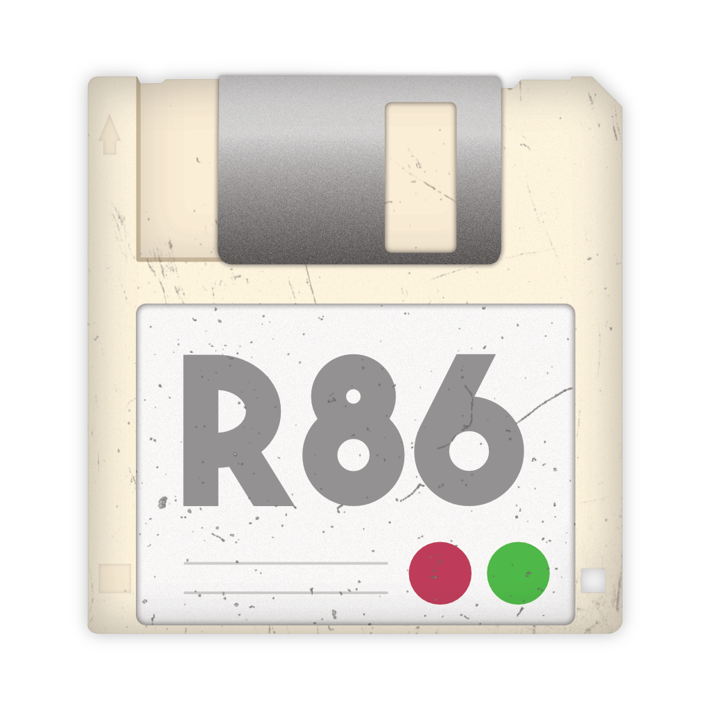

<div align="center">
  <a href="https://github.com/ArtichOwO/r86">
    
  </a>

  <h4 align="center">
    r86 is a 8086 real mode programming language which supports segmentation
  </p>
</div>

## Build
```bash
# Print deps
dune external-lib-deps @@default
# Build
dune build
# Build & run
dune exec bin/main.exe -- example.86s
```
r86 also requires [nasm](https://www.nasm.us) to compile its generated assembly.

## Features
r86 aims to ease programming of real mode executables, with a syntax similar to C.  
[GCC](https://gcc.gnu.org) only generates 32/64-bit assembly (or v8086 with the `-m16` flag) and [SmallerC](https://github.com/alexfru/SmallerC) only generates 16-bit and 32-bit 80386+ assembly, while r86 should compile 8086-compatible executables.

### Pointers
```c
// Near pointers :
localVariable (=> SS:BP+<offset>)
staticVariable (=> DS:staticVariable)

// Far pointers
0xB8000 (=> 0xB000:0x8000) // Constant
0xB000:variableName // Composed with constant and label
0x1234:0x5678 // Composed with constants
```

### Functions
```c
near nearFunction() {
  doSomething() // Near call
}

far farFunction() {
  0xCAFE:doSomethingElse() // Far call with label
  0x12345() // Far call with constant
  0x1000:0x2345() // Far call with constants
}
```

### RPN
```c
let foo = (1 2 +
           8 4 -
           *) // == 12
```

### Types
There is no real typing as you could see in other languages, only two sizes : `byte` and `word`.

## Example
```c
// memset to different segment
global near memset(segment, offset, value, size) {
    until (word size == 0) {
        *segment:offset = byte value
        size = (size 1 -)
        offset = (offset 1 +)
    }
}
```
